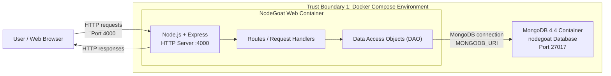

# NodeGoat Application Architecture

```mermaid
flowchart LR
    User["User / Web Browser"]

    subgraph Docker["Trust Boundary 1: Docker Compose Environment"]
        subgraph Web["NodeGoat Web Container"]
            Express["Node.js + Express<br/>HTTP Server :4000"]
            Routes["Routes / Request Handlers"]
            DAO["Data Access Objects (DAO)"]

            Express --> Routes
            Routes --> DAO
        end

        Mongo["MongoDB 4.4 Container<br/>nodegoat Database<br/>Port 27017"]

        DAO -->|"MongoDB connection<br/>MONGODB_URI"| Mongo
    end

    User -->|"HTTP requests<br/>Port 4000"| Express
    Express -->|"HTTP responses"| User
```
